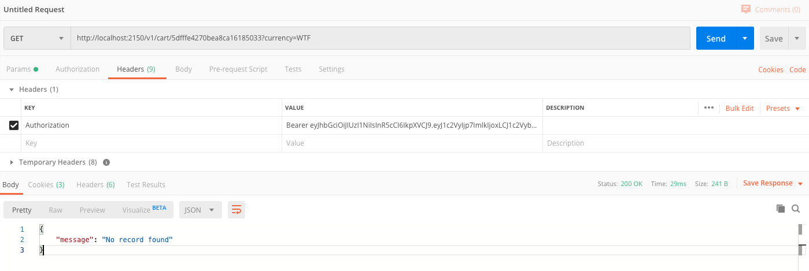

# Flip Fit Node 

The REST API for the reqruitment process.

## Machine Prep
Recomendation to use node -v 12.14.0

```
$> brew install node
```


## Installation

```
$> npm install
```


## Start the server
Make sure that .env file has correct values

```
$> PORT=2150
$> EXCHANGE=https://api.exchangeratesapi.io/latest
```
Then, just simply do:
```
$> npm start
```

To use each of API, there is needed to generete Bearer Token by calling:
``` 
GET http://localhost:2150/v1/login
```
And then catch returned value and set Authorization header to it
 

Once application start there is possibility to check if is up and running:
```
Santa Claus: 
GET http://localhost:2150/v1/
Swagger Docs: 
GET http://localhost:2150/v1/api-docs/
```

## Tests

```
$> npm test
```

Enjoy :-)
